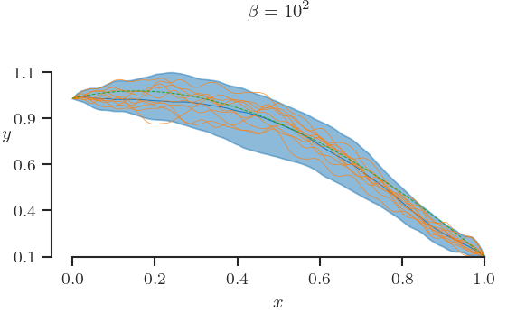
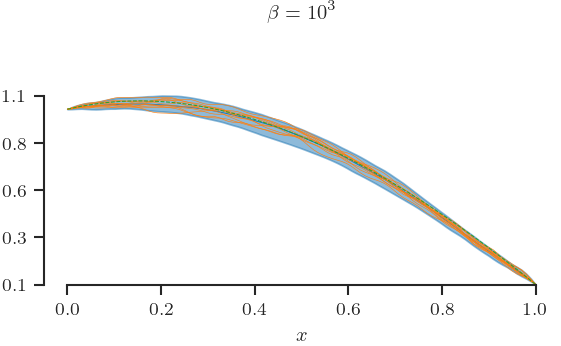
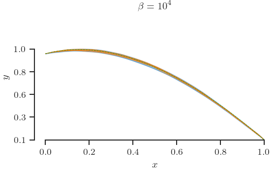
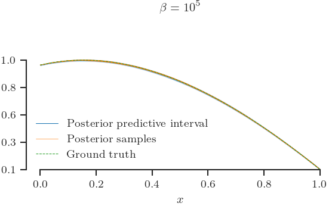

# Reproducing the results of Example 1

## Objective
The objective of this example is to demonstrate how the inverse temperature
$\beta$ detects model form error.
Namely, we see that:
+ if the model is correct, $\beta$ tends to be large
+ if the model is wrong, $\beta$ tends to be small.

## Mathematical details
In this example the spatial domain is $[0, 1]$.
The ground truth field satisfies the equation:

$$
D\frac{d^2\phi}{dx^2} - \kappa \phi^3  = f,
$$

with source term:

$$
f(x) = \cos(4x),
$$

conductivity:

$$
D = 0.1,
$$

non-linear coefficient:

$$
\kappa = 1,
$$

and boundary conditions:

$$
\phi(0) = 0, 
$$

and

$$
\phi(1) = 0.
$$

We sample the field at $40$ equidistant points between $0$ and $1$ and we add
Gaussian noise with zero mean and standard deviation $0.01$.
The observed field inputs are [here](example02_n=40_sigma=1.00e-02_0_x_obs.csv)
and the observed field otuputs are [here](example02_n=40_sigma=1.00e-02_0_x_obs.csv).
If you wish to review how the observations were generated, consult script
[](example02_generate_observations.py).


We introduce 

The Hamiltonian is:

$$
H = \int dx \left\[\frac{1}{2}\kappa \left(\frac{d\phi}{dx}\right)^2 - \phi q\right].
$$

## Running the example

Make sure you have compiled the code following the instructions 
[here](../README.md).
The script [example01_run.sh](./example01_run.sh) reproduces the paper figures.
To run it, change in the directory `./examples` and type in your terminal:
```
./example01_run.sh
```

If you wish to change any of default settings, feel free to edit the 
corresponding configuration file: [example01.yml](./example01.yml).

## The results

The above script creates the following figures and puts them in a directory
called `example01_results`.





